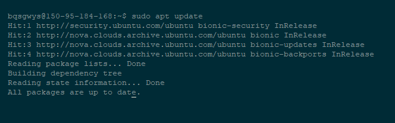
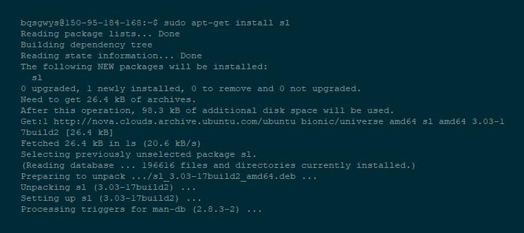
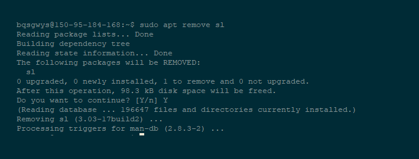
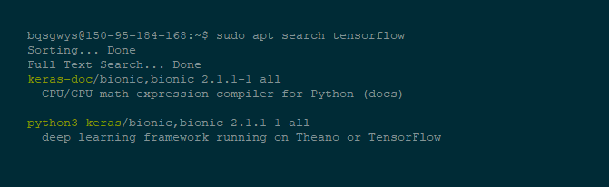
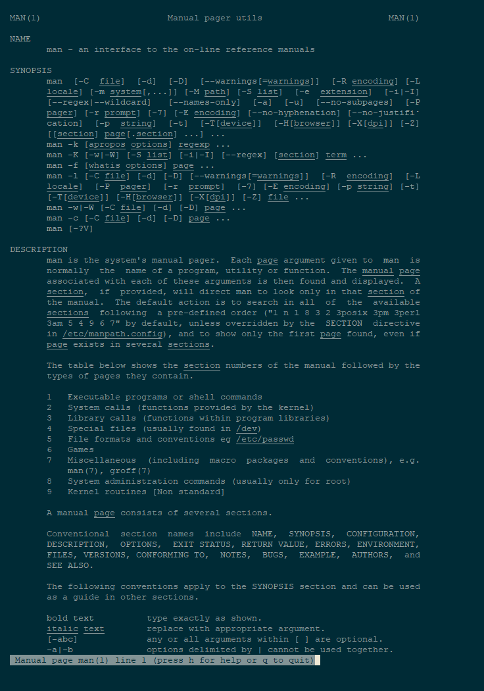
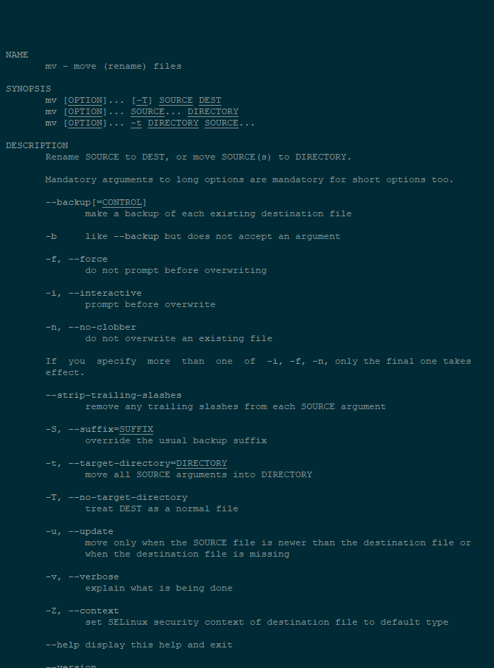
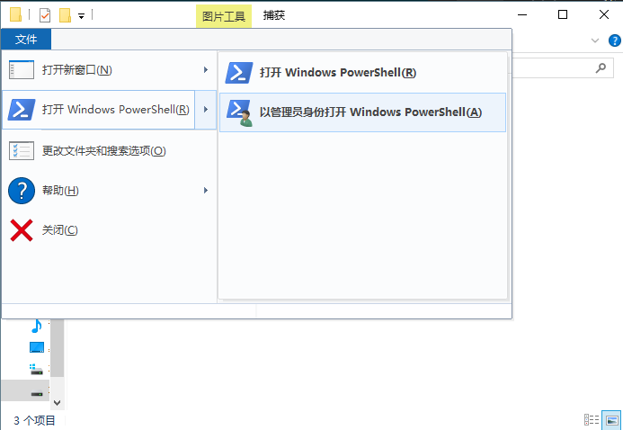

# 
第一章：操作系统

# 
一、绪论

## 1.我们为什么要学这个
朋友，操作系统是你进行开发最基本的平台，所以熟练使用他就至关重要；其二，为了让自己~~显得很professional~~和更加迅速的开发编译，使用命令行(CMD/Bash/Zsh)就特别重要。

## 2.我们在这一节课将学到什么
如果你是利纳斯玩家，你将学到在bash或zsh下如何使用以下指令：
- Apt/Aptitude
- Git
- Man
- Cd,pwd等基础指令

并安装(如果你想的话)oh-my-zsh

如果你是软饭，你将学到如何使用cmd和powershell和安装并利用git。

## 3.只用Windows/Linux的一点建议
为了节省时间，尽快进入项目，如果你已经选定项目或操作系统，你当然可以不看另外的教程。

&nbsp;

&nbsp;

# 
二、Linux

## 1.认识Linux
### a ) 何为Linux
我觉得你们应该早就听说过Linux，事实上Linux出现的也很早。你们用的发行版应该是Ubuntu，这个发行版挺不错的，好用。

废话扯了不少啊么什么是Linux呢？
>Linux是一种自由和开放源代码的类UNIX操作系统。只要遵循GNU通用公共许可证（GPL），任何个人和机构都可以自由地使用Linux的所有底层源代码，也可以自由地修改和再发布。

说白了就是源代码开放的一个操作系统内核，衍生出不同的操作系统，成为发行版，值得注意的是，Linux官方的吉祥物，一只叫Tux的企鹅与国内某家公司的吉祥物有些相似 &#x1F602; &#x1F602; &#x1F602;，但他是在1996年被创造的。

### b ) 我们为什么要用Linux
- 个人使用很少有版权问题，绝大多数都是免费使用，几乎无所谓盗版问题。
- 新的Linux发行版大多数软件都有服务器的服务，只要点击就可以自动下载、安装经过认证的软件，不需要到市面购买、安装。
- Linux学习的投资有效时间较长。旧版软件、系统都还是存在，有源代码可以派生、分支，就算被放弃，还是可以凭借源代码派生。新的软件更新发展多样化，容易养成用户习惯掌握原理，而不是养成操作习惯。
- 强大的Shell及脚本支持，容易组合出匹配需求的环境或创造自动程序。
- 强大而广泛的开源环境，社区支持和新项目层出不穷，更适用于项目、学习和研究

### c ) Linux怎么安装
在国内的话，一般到[清华大学开源软件镜像站](https://mirrors.tuna.tsinghua.edu.cn/)下载发行版并刻盘，安装。建议使用[Ubuntu 18.04 LTS Desktop](https://mirrors.tuna.tsinghua.edu.cn/ubuntu-releases/bionic/ubuntu-18.04-desktop-amd64.iso)。

或者你也可以去[Ubuntu的官网](https://www.ubuntu.com)下载。

## 2.使用Linux
### a ) 安装软件
***如果你是Ubuntu那么请继续往下看否则请跳过，因为不同发行版包管理不同。***

#### 软件命令
在Ububtu当中，Apt/Aptitude是一个很好用的包管理工具，使用简单，命令简单。所以我们首先学习使用它。(注释：sudo指在非root下运行的前缀命令)
- `update`命令 
    `update`命令是用于更新软件数据库的，命令格式是`(sudo) apt update`。输入完了后将出现更新字样并重新加载数据库如下图:

- `install`命令 
    `install`命令是用于安装软件或库的，命令格式是`(sudo) apt install [*你想装的应用的名*]`。输入完了后将出现安装字样要求确认，确认后正式下载安装如下图(以sl为例):

当然，你如果想要特定版本的，可以 apt install [*名字*]=[*版本*]
- `remove`命令 
    `remove`命令是用于卸载软件或库的，命令格式是`(sudo) apt remove [*名字*]`。输入完了后将出现确认卸载字样并在确认后卸载:

- `search`命令 
    `search`命令是用于搜寻软件或库的，命令格式是`(sudo) apt remove [*模糊名字*]`。输入完了后将出现一大堆名字或描述中含有该字符串的软件全名供下载选用:

#### 软件换源
事实上，如果你刚才认真地去做了，你就会发现网慢到爆炸，这时候我们就需要景象服务器登场了，而镜像服务器就是为了我们这种懒人和网络不好的人准备的，所以我也懒一次，完整代码在[清华大学开源软件镜像站](https://mirrors.tuna.tsinghua.edu.cn/help/ubuntu/)上。***重要：换源需要root权限***或者，如果你确定自己的系统是18.04LTS，可以用教程带的文件加上cp/mv等命令移到/etc/apt下，而这两个命令都在以后会讲到。

### b ) 系统自带文档
#### 使用man查看
man是menual(手册)的缩写,我们一般利用`man`查看一个命令或程序的使用方法。
#### man的命令构成

- 语法： 
    `man (选项) (参数) [手册名称]`
- 选项： 
    `-a`：在所有的`man`帮助手册中搜索； 
    `-f`：等价于`whatis`指令，显示给定关键字的简短描述信息； 
    `-P`：指定内容时使用分页程序； 
    `-M`：指定`man`手册搜索的路径。 
- 参数
    - 数字，表示第几章节:
        1. 系统命令
        2. 系统接口
        3. 函数库
        4. 特殊文件，比如设备文件
        5. 文件
        6. 游戏
        7. 系统的软件包
        8. 系统管理命令
        9. 内核
    - 关键字 表示需要寻找找哪个关键字
- 实例 
命令`man 1 man`表示查找`man`指令文档的第一章，查询结果如下：

### c ) 其他基础文件系统命令
我们通过mv这个例子来学习一下使用man：
我们使用命令`man mv`效果如下：
其中SYNOPSIS是语法，DESCRIPTION是描述。还是解释的比较详尽的，类似的，我们也可以学习通过`man`学习`cd`,`ls`,`cp`,`pwd`,`rm`。而这些就留作练习吧&#x1F602; &#x1F602; &#x1F602; 。

### d ) 练习：
- 安装python3、nodejs(如果没有)；
- 学习`cd`,`ls`,`cp`,`pwd`,`rm`语法；
- 在~目录下创建workspace文件夹
- 安装vscode或任意一个IDE

# 
三、Windows

## 1.认识Windows10
Hi,this is Windows10.
## 2.使用Windows10
不同于Linux命令行的苦逼，Windows要好很多，转移目录等行为都可以通过文件资源管理器来完成。
### a ) 打开命令行或Powershell
这样就行了：
如果你是powershell想用cmd，直接输入`cmd`指令就行了。

### b ) 使用命令行或Powershell
#### 基础文件系统命令
直接用"文件资源管理器"吧骚年。

如果你真的想用命令的话，看看Linux的教程，都是大同小异的。
#### 运行程序
在你喜欢的程序文件夹内打开命令行，然后用 `./[运行程序名.exe] (--参数 参数)... [必须参数]` 运行或者用 `./[运行程序名.exe] --help` 来看帮助（部分程序没有帮助，这时请转向Google寻求帮助）
### c ) 练习
- 自愿吧，你们使Windows都挺6的，试试用命令行跑ping这个程序`ping me.bqsgwys.xyz`（在哪个目录下都行），并尝试不同参数造成的影响。

# 
四、Git

## 1.什么是Git
> Git是一个分布式版本控制软件，最初由林纳斯·托瓦兹（Linus Torvalds）创作，于2005年以GPL发布。最初目的是为更好地管理Linux内核开发而设计。

但这并不重要，我们只需要知道基本上大部分开源代码都在[Github](https://www.github.com)上，用Git管理就行了

## 2.安装
### Windows10下安装
请到[GitforWindows](https://gitforwindows.org/)下载安装
### Ubuntu下安装
请用apt下载安装。

## 3.指令
### a ) 约定译名
- Workspace：工作区
- Index/Stage：暂存
- Repository：本地仓库
- Remote：远程仓库
### b ) 新建本地仓库命令

- 新建一个目录作为Git代码库
`git init [项目名称]`

- 在线克隆一个项目
`git clone [项目网址]`

### c ) 配置和配置命令

#### 配置文件

Git的设置文件为`.gitconfig`

***注意：它可以在用户主目录下（全局配置），也可以在项目目录下（项目配置）。***

#### 配置命令

- 显示*当前位置*的Git配置（可为全局配置） 
    `git config --list`
- 编辑*当前位置*Git配置文件 
    `git config -e (--global)`
- 设置在线提交代码时的用户信息 
    `git config (--global) user.name "[用户名]"` 
    `git config (--global) user.email "[用户邮箱]"`

#### 其他配置参数
如有需要，请自行搜索学习

### d ) 代码提交
- 提交暂存区到*本地*仓库 
`git commit -m [更新信息]`
- 提交暂存区的指定文件到仓库区 
`git commit [文件1] [文件2] ... -m [更新信息]`
- 提交工作区自上次commit之后的变化，直接到*本地*仓库 
`git commit -a`

### e ) 分支
#### 什么是分支
>几乎所有的版本控制系统都以某种形式支持分支。 使用分支意味着你可以把你的工作从开发主线上分离开来，以免影响开发主线。
说白了，分支就是一个多人合作开发不同功能是各自独立开发的过程，防止互相影响的结构。在Git中，默认的分支名是`master`

#### 指令
- 列出所有*本地*分支 
`git branch`
- 列出所有本地分支和远程分支 
`git branch -a`
- 新建一个分支，但依然停留在当前分支 
`git branch [分支名]`
- 切换到指定分支，并更新工作区 
`git checkout [分支名]`
- 删除分支 
`git branch -d [分支名]`
- 合并指定分支到当前分支 
`git merge [分支名]`
- 删除分支 
`git branch -d [分支名]`

### f ) 查看历史信息
- 显示有变更的文件 
`git status`
- 显示当前分支的版本历史 
`git log`
- 显示暂存区和工作区的代码差异 
`git diff`
- 显示某次提交的元数据和内容变化 
`git show [某次提交]`

### g ) 远程同步
- 取回远程仓库的变化，并与本地分支合并 
`git pull [远程仓库] [分支名称]`
- 上传本地指定分支到远程仓库
`git push [远程仓库] [分支名称]` 

## 4.练习 
随便放点啥到Github，然后各种操作都试验一下。