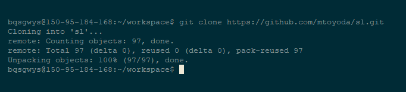
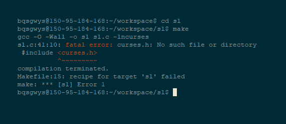
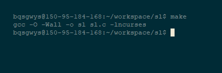
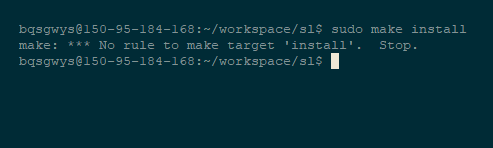

# 
第二章：编译与安装

# 
一、绪论

## 1.我们为什么要学这个
朋友们，我们一般使用Windows时，如果要安装应用，只要下载安装文件并双击就行了，但由于一些特殊的应用因系统不同而不同，有些时候我们只能下载它的源代码并手动编译，这样的话，我们就需要

## 2.我们在这一节课将学到什么
通过这节课的学习，我相信你们会学到如何下载源代码并手动编译安装它们。或者下载已经编译好的的应用并且安装它们。

&nbsp;

&nbsp;

# 
二、准备工作

## 1.安装编译环境
- Windows10: 
你需要安装[VisualStudio](https://visualstudio.microsoft.com/)至少是community版； 
之后你需要下载安装[cmake](https://cmake.org/) 
如果需要的话，你还要安装[MinGW](http://www.mingw.org/)中的gcc,g++
- Linux
直接使用apt安装`build-essential`和`cmake`就行了:`(sudo) apt install build-essential cmake`apt会帮你处理其他事情的。

## 2.Make初体验
### a ) 流程介绍
如果我们使用Make编译安装应用的话，一般分为以下几步：
- ./configue 
有可能这个程序需要一些必须的库或替代库才能编译，且方法随替代库的不同而不同，或者有不同的编译方法，通过观察源代码根目录下是否有configue或类似名称的可运行文件来判断是否要这步，如果需要，运行`./configue`来自动配置。
- make 
这步通过自动读取MakeFile来进行编译流程。这步可能需要数分钟到数小时不等，一般的如果出现"Warning"可以忽略，但如果make失败就需要观察错误输出来确定问题，问题可能在以下几个方面：
    - 依赖库未安装：安装就行了
    - 平台不支持：换台电脑或换个操作系统
    - 作者源代码有问题：去issue区查找问题和解决方案
- make check / make test 
千辛万苦编译完了，我们还得确认它是*好*的，这时就需要用到`make check`或`make test`，当然，有些程序是不需要的。
- (sudo) make install 
这步是在安装软件，所以需要sudo权限，普遍的，这步会比`make`快，因为不涉及编译。
- make clean 
这步是献给强迫症患者，用处是删除临时文件
### b ) 安装软件实例
我们以github上`mtoyoda/sl`这个小程序安装为例介绍一下make的流程。
这个小程序是用来"Cure your bad habit of mistyping"，即治疗错误打字的坏习惯，具体效用就是如果你错误地把`ls`(还记得这个是干什么用的么)敲成`sl`的话，就会生成一个小火车：

- 第一步 
希望你们没有忘，真正的第一步是下载源代码 &#x1F602; ，这个源代码存放在[github](https://github.com/mtoyoda/sl)上,首先将它`git clone`下来如下：
- 第二步 
我们直接`make`试试：结果`Error`了！
这是为什么呢？通过阅读错误信息我们知道，缺少了一个叫`<curses.h>`的库，于是我们Google一下发现这个库只需要安装`ncurse`就行了于是我们安装后继续`make`

这个`make`好短啊，也是，这本身就是个小程序，长的`make`可能高达数千甚至万行，需要几个小时编译
- 第三步 
第三步什么来着？安装`make install`!问为甚么不是test或check，这么小的项目check个鬼啊！发现这个东西并不能install
- 第四步 
Have Fun and Good Luck
我们可以开心的玩♂这个程序了`./sl`[图2.2.6](./2/2.2.6.png)
### c ) 练习
除了sl外你们可以找一些有趣的git小程序练习使用make一下