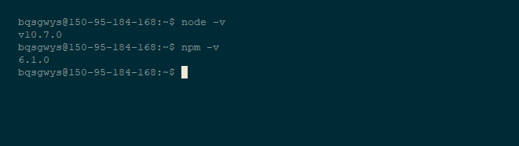
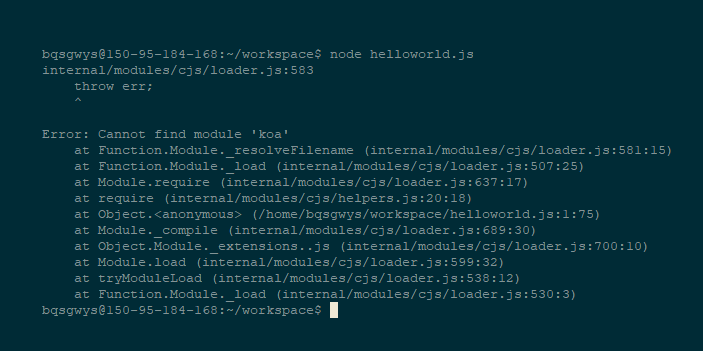
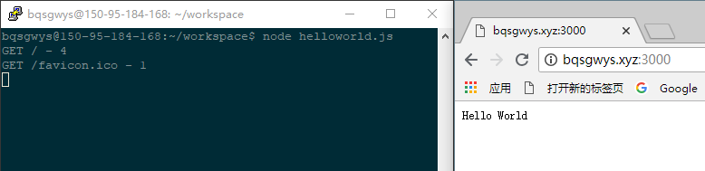
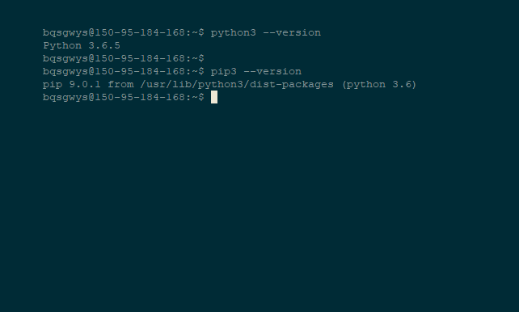
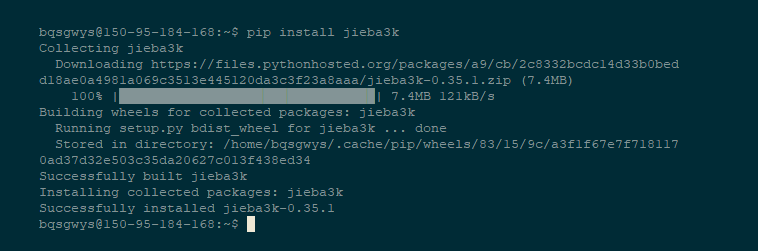

# <center>第三章：Javascript，Python</center>

# <center>一、绪论</center>
## 1.这是啥？
> JavaScript，通常缩写为JS，是一种高级的，解释执行的编程语言。JavaScript是一门基于原型、函数先行的语言[5]，是一门多范式的语言，它支持面向对象编程，命令式编程，以及函数式编程。Node.js是一个能够在服务器端运行JavaScript的开放源代码、跨平台JavaScript 运行环境。<br>
> Python是一种广泛使用的高级编程语言，属于通用型编程语言，由吉多·范罗苏姆创造。作为一种解释型语言，Python的设计哲学强调代码的可读性和简洁的语法。相比于C++或Java，Python让开发者能够用更少的代码表达想法。不管是小型还是大型程序，该语言都试图让程序的结构清晰明了。

换而言之JavaScript是一种脚本语言，应用于网页，而Node.js是一个在服务器段运行基于JS的服务端的环境，也就是说JS写的服务器。
而Python却不同，Python有些类似C/C++，更为应用广泛。
## 2.我们要干啥
事实上，这节课你并不能学到如何编写JS和Python，但这节课你将学到
- 如何用npm安装nodejs环境
- 如何利用pypi安装python库
- 如何利用conda建立虚拟环境
- 会看简单的报错

# <center>二、Node.js</center>
## 1.安装环境
### a) Linux
采用`(sudo) apt install nodejs npm`安装nodejs和npm
### b) MacOS
在[这里](https://nodejs.org/dist/v8.11.3/node-v8.11.3.pkg)下载pkg并安装
### c) Windows10
在[这里](https://nodejs.org/dist/v8.11.3/node-v8.11.3-x64.msi)下载msi并安装

#### ***注意：无论你在何种系统下，请将Node.js加入环境变量Path中***
## 2.测试
在命令行下分别使用命令`npm -v`和`node -v`查看安装版本即可,结果如下图：
## 3.安装依赖库
我们都知道，不同的库保证了语言的功能多样化和简单化，也就是说我们不用再去“造轮子”，Nodejs也是这样的。
我用一个网站开发实例来解释如何安装依赖库：
- 我们会看到在[这里](./4/helloworld.js)有一个js文件，我们用nodejs运行它`node helloworld.js`： 
发现它报错了，阅读报错得知缺少koa库，我们用npm（Node.js Packages Manager）安装依赖
- 一般来讲，我们使用`npm install [package] (^VersNum)`安装依赖,如我们用`npm install koa`就安装上了koa。
- 运行程序`node helloworld.js`： 
- 如果那个应用有"package.json"你也可以直接使用`npm install`安装所有依赖库，范例见[这里](./4/dependency)
## 3.NPM选项解析
- --save 或 -S <br>
`npm install [package] [--save/-S]`表示将报名和版本存到package.json以便于别人或在其他地方安装该依赖
- -g 或 --global<br>
`(sudo) npm install [package] [-g/--global]`
安装系统的模块（不加参数的时候默认安装到本文件夹下），系统模块指可以直接在命令行下运行的模块。如npm版的sl。
- uninstall<br>
`npm uninstall [package] (option)`卸载已经安装的模块，后面的options参数意思与安装时候的意思一样
- update<br>
`npm update (-g)`更新已经安装的模块(或全局的模块)
## 4.NPM换源
我们使用`(sudo) npm install -g cnpm --registry=https://registry.npm.taobao.org`安装一个叫cnpm的命令行工具，并用它正常像npm一样使用，

# <center>三、Python</center>
## 1.安装环境
### a) Linux
采用`(sudo) apt install python3 python3-pip`安装python3和pip3
### b) MacOS
在[这里](https://www.python.org/ftp/python/3.7.0/python-3.7.0-macosx10.9.pkg)下载pkg并安装
### c) Windows10
在[这里](https://www.python.org/ftp/python/3.7.0/python-3.7.0-amd64.exe)下载msi并安装

#### ***注意：无论你在何种系统下，请将Python3和pypi3加入环境变量Path中***
## 2.测试
在命令行下分别使用命令`python3 --version`和`pip3 -v`查看安装版本即可,结果如下图：
## 3.安装依赖库
事实上，Python和Node.js一样需要安装依赖库，但不同的是python的依赖一般都是全局的。我们试图安装一下著名的分词库“结巴”
用一下命令安装`pip3 install [packege]`这里是`jieba3k`：
接着我们测试一下[这个文件](./4/jiebatest.py)
希望你们好运。
#### 附：pypi换源较为复杂，教程点击[这里](https://mirrors.tuna.tsinghua.edu.cn/help/pypi/)
## 4.虚拟环境
因为python的依赖库是全局的，所以就会出现一些问题，即如果两个库是冲突的，项目A和项目B各用一个，你也无法修复，这时候就要用到虚拟环境。
一般来讲，我会给人安利Conda，因为这个东西还保证了你安装一些像Opencv这样的库的时候不用再去手动make。
### a) 安装anaconda
到[这里](https://mirrors.tuna.tsinghua.edu.cn/anaconda/archive/)下载你需要的AnaConda包并安装(_越往下越新_)，建议将conda设为默认python和系统环境路径
### b) 换源
我们采用如下命令换源：
```
conda config --add channels https://mirrors.tuna.tsinghua.edu.cn/anaconda/pkgs/free/

conda config --add channels https://mirrors.tuna.tsinghua.edu.cn/anaconda/pkgs/main/

conda config --set show_channel_urls yes
```
其它源点击[这里](https://mirrors.tuna.tsinghua.edu.cn/help/anaconda/)查看看。
### c) 创建虚拟机
假设我们要创建一个Opencv3的虚拟环境
我们先用`conda create -n opencv python=3.6`创建一个名字叫做"opencv"python版本3.6的虚拟环境
然后用`activate opencv`进入它的环境，此时你的命令行左边会出现'(opencv)'字样。
### d) 安装依赖
在虚拟环境内，除了可以用pip（没有23之分）正常安装依赖库外，还可以通过`conda install [package]`安装一些不是用python编写的依赖库，如opencv3。我们用conda安装opencv这个库（`conda install opencv`）然后会自动下载安装完成。
### e) 运行吧！骚年！
没错，就是那个bound.py,在opencv的加持下运行吧！
# <center>四、练习</center>
## a)Node.js
玩完了koa2的server玩一玩express吧！
## a)python
先下载[predictor](http://download.bqsgwys.xyz/download/predictor.7z)并解压到detect下，然后
conda下运行`conda config --add channels https://mirrors.tuna.tsinghua.edu.cn/anaconda/cloud/menpo/`加menpo源，然后安装人脸识别dlib,最后pypi安装scikit-image,然后就可以运行detect.py开心一下！
